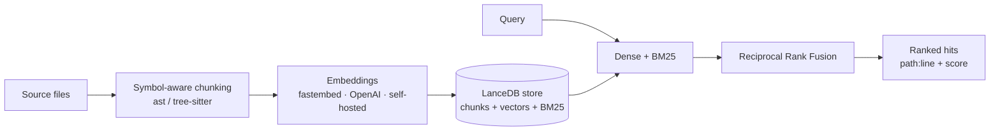

<p align="center">
  
</p>

# CodeRAG

**A standalone, local-first semantic code-search engine for large and custom codebases.**

[](https://www.python.org/downloads/)
[](https://opensource.org/licenses/Apache-2.0)
[](https://github.com/Neverdecel/CodeRAG/actions/workflows/ci-tests.yml)
[](https://codecov.io/gh/Neverdecel/CodeRAG)
[](https://github.com/Neverdecel/CodeRAG/actions/workflows/docker-beta.yml)
[](https://github.com/Neverdecel/CodeRAG/pkgs/container/coderag)
[](https://scorecard.dev/viewer/?uri=github.com/Neverdecel/CodeRAG)
[](https://coderag-ui.neverdecel.com/)

CodeRAG indexes a whole codebase into a hybrid (vector + keyword) search index and answers
questions like *"where is retry/backoff handled?"* with the exact functions, classes, and
files that matter — ranked by meaning, not just string match.

It runs **entirely on your machine with no API key** (a local ONNX embedding model is the
default), keeps its index **up to date as you edit**, and is built to stay fast on **large
codebases**. Use it from the **CLI**, embed it as a **Python library**, self-host it as an
**HTTP service**, browse with the **web UI**, or plug it into an **AI coding agent over MCP**
so it searches a warm index instead of grepping.

> Built for the cases off-the-shelf IDE assistants don't cover well: a codebase that's too
> big, too private, or too custom — or a search/RAG capability you want to own and embed in
> your own tools.

> **🔎 Try the live demo:** **<https://coderag-ui.neverdecel.com/>** — a read-only CodeRAG
> web UI indexing this repo, so you can run real hybrid searches in the browser before
> installing anything.

## ⚡ Find the right code in one call — not a grep loop

Coding agents like Claude Code and Codex locate code by *running searches* — grep, glob, read,
repeat — which burns tokens and round-trips and reduces to literal keyword matching. CodeRAG
turns the workspace into a **warm, pre-indexed** engine: a single query returns the right
functions and files ranked by **meaning *and* keyword**, with exact `path:line` citations. The
embedding model loads once, so each query is one in-process lookup (vector ANN + BM25 + fusion), not
a multi-round shell loop — and over MCP (`coderag mcp`, below) it becomes the agent's search tool.

**Proof from the eval harness** — this repo's 24 natural-language → file queries (90 files /
553 chunks), local `bge-small`, one warm query each (reproduce with `coderag eval --compare
--dataset coderag/eval/datasets/coderag_self.jsonl`):

| retrieval | MRR | R@1 | R@5 | Hit@10 |
| --- | :---: | :---: | :---: | :---: |
| BM25 — ranked keyword search (already stronger than raw grep) | 0.751 | 0.604 | 0.854 | 1.000 |
| dense — semantic only | 0.784 | 0.604 | 0.938 | 1.000 |
| **hybrid — CodeRAG's default** | **0.822** | **0.688** | **1.000** | **1.000** |

Hybrid puts a relevant file in the **top-5 for every query** and ranks it **#1 ≈69%** of the
time — beating the ranked-keyword search a grep-based agent leans on (raw grep is weaker still:
unranked literal match) by adding semantic understanding on top. To measure the *latency* and
*token-cost* gap against an actual grep loop on your own repo, run
[`scripts/bench_vs_grep.py`](scripts/bench_vs_grep.py). The fuller story — symbol-level
localization, the reranker (**+55% R@1** where there's headroom), multi-repo generalization,
and the honest caveats — is in [`docs/eval.md`](docs/eval.md).

---

## ✨ Highlights

- **Local-first, zero-key.** Default embeddings run locally via [fastembed](https://github.com/qdrant/fastembed) (ONNX, no PyTorch). Self-hosted, OpenAI, and Anthropic backends are all optional add-ons.
- **Bring your own model platform.** Built for self-hosted and local models first (any OpenAI-compatible server — Ollama, vLLM, LM Studio, LocalAI), with first-class **OpenAI API** and **Anthropic API** support when you want it.
- **Symbol-aware chunking.** Indexes *functions, classes, and methods* (Python via `ast`; JS/TS/Go/Rust/Java via tree-sitter), not crude fixed-size blocks — so results point at real code units with `file:line` citations.
- **Hybrid retrieval, with optional reranking.** Dense vector search **+** BM25 keyword search, fused with Reciprocal Rank Fusion — great at both "what does this *mean*" and exact-identifier lookups. Add an optional local **cross-encoder reranker** (two-stage retrieve-then-rerank, `CODERAG_RERANK=1`, no API key) to sharpen the top results.
- **Semantic *and* exact search in one tool belt.** Agents get `search_code` (hybrid, by meaning) **and** `search_files` (ripgrep-backed exact regex/glob, the literal-match complement) — plus loop-detection, pagination, and line-numbered reads with "did you mean?" hints. No more grep/glob/find loops.
- **Drop-in for AI coding agents — one command.** `coderag install` wires the **MCP server** into **Claude Code**, **Hermes**, and **Codex** (auto-detect or an interactive wizard, idempotent, with backups) so they search a warm, pre-indexed workspace instead of slow grep/glob/read loops — ranked `path:line` results from a single call, index kept live as you edit. Works on a plain file directory too, not just code.
- **Measured, not guessed.** A built-in **evaluation harness** (`coderag eval`) scores retrieval quality — recall@k, MRR, nDCG@k at file *or* symbol level — and can mine a benchmark straight from your git history. Every default (1:1 hybrid, reranker opt-in, adaptive fusion off) is the choice the harness validated, including across an external repo.
- **Incremental & live.** Content-hashed indexing only re-embeds files that changed; a debounced watcher keeps the index current as you code. No duplicate or stale vectors.
- **Built to scale.** An embedded [LanceDB](https://github.com/lancedb/lancedb) store: brute-force exact search for small repos, automatic ANN indexing past a threshold so it stays fast at 100k+ chunks.
- **Five surfaces, one engine.** CLI · Python library · HTTP/REST · web UI · MCP server — all thin wrappers over the same `CodeRAG` object.

### ⚡ One line: install + wire into your agent

Download, install, and register CodeRAG as your coding agent's search tool — in a single command. [pipx](https://pipx.pypa.io) drops it into an isolated environment and puts `coderag` on your `PATH` — exactly what your agent needs to launch the server:

```bash
pipx install "coderag[mcp] @ git+https://github.com/Neverdecel/CodeRAG" && coderag install
```

This installs the engine **and** MCP server, then `coderag install` auto-detects **Claude Code**, **Hermes**, and **Codex** (or launches an interactive wizard) and wires CodeRAG in. Restart your agent and it searches a warm, pre-indexed workspace instead of grepping. Preview without writing any config: `coderag install --print`.

> No pipx yet? `sudo apt install pipx` (Debian/Ubuntu) or `brew install pipx` (macOS), then `pipx ensurepath` and open a new shell. Prefer plain `pip`? Install into a virtual environment instead (see **Quick start** below) — a global `pip install` is blocked on Debian/Ubuntu and other [PEP 668](https://peps.python.org/pep-0668/) systems.

## 🚀 Quick start

Work inside a virtual environment — a global `pip install` is blocked on Debian/Ubuntu and other [PEP 668](https://peps.python.org/pep-0668/) systems (`error: externally-managed-environment`):

```bash
python3 -m venv .venv && source .venv/bin/activate

pip install -e .            # core engine (local embeddings included)
# optional extras:
pip install -e ".[server]"     # HTTP/REST API
pip install -e ".[ui]"         # built-in web UI (FastAPI + Jinja + Pygments)
pip install -e ".[mcp]"        # MCP server for AI coding agents (Claude Code, Codex, Cursor)
pip install -e ".[openai]"     # OpenAI (or self-hosted OpenAI-compatible) embeddings / answers
pip install -e ".[anthropic]"  # Anthropic (Claude) LLM answers
pip install -e ".[all]"        # everything above
```

> Wiring the MCP server into an agent from a venv? Run `coderag install` through the venv's
> binary (`.venv/bin/coderag install`) rather than after `activate`, so it records the venv's
> Python by absolute path — otherwise the bare `coderag` it writes won't resolve when your agent
> launches the server. Or use **pipx** (above), which keeps `coderag` on `PATH` for good.

Index a codebase and search it — no configuration, no API key:

```bash
coderag index --watched-dir /path/to/your/repo
coderag search "where are duplicate vectors removed on file change" --watched-dir /path/to/your/repo
```

```
1. coderag/indexer.py:141 (Indexer._index_file)  [method, sim=0.70]
   def _index_file(self, item): removed = 0; existing = self.store.get_file(item.rel) …
2. coderag/indexer.py:1  [window, sim=0.74]
   """Incremental indexing orchestration. ...the critical correctness property…"""
```

By default the index lives in `<watched-dir>/.coderag/` (next to the code it indexes, so it's
found no matter where you run `coderag` from). Set `CODERAG_WATCHED_DIR` / `CODERAG_STORE_DIR`
(or copy `example.env` to `.env`) to avoid repeating flags.

## 🧑‍💻 The surfaces

### CLI

```bash
coderag index [PATH] [--full]     # build / incrementally update the index
coderag search "QUERY" [-k 8]     # hybrid search; add --json or --answer
coderag watch                     # index, then keep it live as files change
coderag serve --port 8000         # run the HTTP API  (needs [server])
coderag ui                        # launch the web UI (needs [ui])
coderag mcp                       # MCP server for AI agents (needs [mcp]); --all-text for any dir
coderag install [TARGET]          # wire the MCP server into Claude Code / Hermes / Codex
coderag status                    # index stats (files, chunks, model, index type)
coderag eval --dataset d.jsonl --compare  # retrieval quality: dense vs BM25 vs hybrid
```

> **Measuring retrieval quality.** `coderag eval` is a built-in harness for "did we surface
> the right file/symbol?" — recall@k, MRR, nDCG@k at file or symbol level, with a git-history
> dataset miner (`--build [--level symbol]`), a dense/BM25/hybrid comparison (`--compare`), and
> optional `--rerank` (cross-encoder) and `--adaptive` (query-type fusion weighting) stages. It
> drives the project's tuning: defaults are kept only when the harness shows they hold up. See
> [`docs/eval.md`](docs/eval.md) and the strategy writeup in
> [`docs/research/code-retrieval-strategy.md`](docs/research/code-retrieval-strategy.md).

### Python library

```python
from coderag import CodeRAG, Config

cr = CodeRAG(Config.from_env(watched_dir="/path/to/repo"))
cr.index()

for hit in cr.search("how is the vector index persisted?"):
    print(f"{hit.location}  {hit.symbol}  (sim={hit.similarity:.2f})")
    print(hit.text)
```

### HTTP / REST  (`coderag serve`)

```bash
curl "http://127.0.0.1:8000/search?q=token%20validation&k=5"
curl -X POST http://127.0.0.1:8000/index -d '{"full": false}' -H 'content-type: application/json'
curl "http://127.0.0.1:8000/status"
curl "http://127.0.0.1:8000/file?path=coderag/api.py&start_line=1&end_line=40"
```

Self-host it once and point any number of custom apps or teammates at a big shared codebase.

> **Security.** The API is **unauthenticated by default** and can read indexed source and
> file contents. Keep it on `127.0.0.1` for local use, or set `CODERAG_API_KEY` (sent as
> `Authorization: Bearer <key>` or `X-API-Key`) and front it with TLS / an authenticating
> proxy before exposing it. CORS stays off unless you set `CODERAG_CORS_ORIGINS`. The
> `/file` endpoint only serves files that are actually indexed.

### Web UI  (`coderag ui`)

A built-in, server-rendered web UI (FastAPI + Jinja, syntax highlighting via Pygments):
a search box with language/kind/path filters, results with `path:line` citations and
similarity scores, an in-browser **file viewer** (cited lines highlighted), a **file
browser**, index status, a one-click **Reindex**, and an optional streamed LLM answer
(when an OpenAI/Anthropic key or a self-hosted endpoint is configured). It is progressively
enhanced — every page works with JavaScript disabled, and there's no CDN/runtime network
dependency, so it stays local-first.

See it live (read-only, indexing this repo): **<https://coderag-ui.neverdecel.com/>**.

### MCP — let an AI coding agent search instead of grepping  (`coderag mcp`)

Tools like Claude Code and Codex locate code with iterative `grep`/`glob`/read loops. CodeRAG
exposes the same workspace as a **Model Context Protocol** server, so an agent gets fast,
ranked `path:line` results from a single call against a **warm, pre-indexed** workspace — the
embedding model loads once and every query is then one in-process lookup (vector ANN + BM25 +
fusion), not a multi-round shell search.

```bash
pip install -e ".[mcp]"
coderag mcp                 # index the current dir, keep it live, serve over stdio
coderag mcp --all-text      # index ALL text files (docs/notes/config), not just code
```

It auto-indexes the working directory on startup (in the **background**, so it's responsive
immediately) and keeps the index live with the watcher — zero manual steps. Tools exposed:
**`search_code`** (hybrid semantic search, compact snippets + `path:line`), **`search_files`**
(exact regex/glob search, ripgrep-backed — the literal-match complement to `search_code`),
**`get_file`** (read a precise range of an indexed file, optional line numbers + "did you
mean?" hints), **`index_status`** (coverage/freshness), and **`reindex`**.

#### One-command install (`coderag install`)

Register the server into an agent without hand-editing any config:

```bash
coderag install                 # auto-detect installed agents and wire them up
coderag install --wizard        # interactive: pick agents, workspace, exposed tools
coderag install hermes --print  # preview the exact config change without writing
```

Supported targets: **Claude Code** (`.mcp.json`), **Hermes** (`~/.hermes/config.yaml`, with
`tools.include`), and **Codex** (`~/.codex/config.toml`). It is idempotent and backs up any
file it changes to `*.bak`. The equivalent manual config (the server defaults to the
directory it's launched in):

```bash
# Claude Code
claude mcp add coderag -- coderag mcp
```

```jsonc
// Cursor: .cursor/mcp.json  —  or Claude Code: .mcp.json  (at the repo root)
{ "mcpServers": { "coderag": { "command": "coderag", "args": ["mcp"] } } }
```

```toml
# Codex: ~/.codex/config.toml
[mcp_servers.coderag]
command = "coderag"
args = ["mcp"]
```

```yaml
# Hermes: ~/.hermes/config.yaml
mcp_servers:
  coderag:
    command: coderag
    args: [mcp]
    tools:
      include: [search_code, search_files, get_file, index_status, reindex]
```

> If `coderag` isn't on the launcher's PATH, use an absolute path (or `python -m coderag.surfaces.cli mcp`).
> To index a directory other than where the client launches, add `"--watched-dir", "/abs/path"` to `args`.
> Fast by default (local `bge-small`, no reranker); set `CODERAG_RERANK=1` to trade ~30 ms/query for sharper top results.

**Why bother? Measure it.** [`scripts/bench_vs_grep.py`](scripts/bench_vs_grep.py) scores
indexed search against a raw grep baseline on the same eval dataset — accuracy
(recall@k / nDCG@k / MRR via the eval harness), latency per query, and approximate context
tokens (compact chunks vs reading whole files):

```bash
python scripts/bench_vs_grep.py --watched-dir . --dataset coderag/eval/datasets/coderag_self.jsonl
```

## 🐳 Docker (beta)

Prebuilt **multi-arch** images (`linux/amd64` + `linux/arm64`) are published to GHCR on
every push to `master`. **Beta** — interfaces and tags may change.

```bash
# HTTP/REST API on :8000 — mount a repo to index, persist the index in a named volume
docker run --rm -p 8000:8000 \
  -v "$PWD:/workspace:ro" -v coderag-index:/data \
  ghcr.io/neverdecel/coderag:beta

# build the index once, then query the running server
curl -X POST localhost:8000/index -H 'content-type: application/json' -d '{"full": true}'
curl "localhost:8000/search?q=where%20is%20retry%20handled&k=5"
```

```bash
# Web UI on :8501
docker run --rm -p 8501:8501 \
  -v "$PWD:/workspace:ro" -v coderag-index:/data \
  ghcr.io/neverdecel/coderag:beta-ui
```

Tags: `:beta` (latest `master`), `:edge` (alias), `:sha-<commit>` (immutable); the UI image
adds a `-ui` suffix. The container indexes `/workspace` and stores its index in `/data`
(`CODERAG_WATCHED_DIR` / `CODERAG_STORE_DIR`). For OpenAI embeddings/answers, add
`-e OPENAI_API_KEY=…`. The container binds `0.0.0.0`, so set `-e CODERAG_API_KEY=…` and
keep the port on a trusted network (or behind an authenticating proxy) when exposing it.

## ☸️ Kubernetes (Helm)

For teams who want a shared, always-on deployment, a Helm chart self-hosts the HTTP API
(and optional UI) with a persistent index, scheduled re-indexing, and hardened defaults
(non-root, read-only rootfs, single-writer-safe). It runs **standalone with zero config**
on your cluster's default storage:

```bash
helm install coderag ./deploy/helm/coderag --namespace coderag --create-namespace
```

Then point it at your code (a git repo, or a PVC you already have):

```bash
helm upgrade coderag ./deploy/helm/coderag -n coderag --reuse-values \
  --set workspace.source=git \
  --set workspace.git.repository=https://github.com/Neverdecel/CodeRAG.git
```

It provisions the index volume, clones the repo into the pod, and builds the index
automatically. Not a Helm user? `helm template … | kubectl apply -f -` works too. See the
full guide — storage options, private repos, OpenAI/Anthropic keys, ingress, the UI,
scheduled reindex — in [`deploy/README.md`](deploy/README.md).

## 🏗️ How it works



- **One embedded LanceDB store** holds everything — chunk text, line ranges, symbols, content
  hashes, the vectors (ANN), and the BM25 index — so there is no separate cache to keep in
  sync. The store is also a rebuildable view of your code: it can always be re-indexed from
  source, so switching embedding models never corrupts your data.
- Each file's content is **hashed**; unchanged files are skipped on re-index (a cheap
  size+mtime check avoids even reading them). A changed file's old chunks are removed
  **before** new ones are added — so editing never accumulates stale or duplicate vectors.

## ⚙️ Configuration

CodeRAG runs **fully locally with no API key** out of the box — everything below is
optional. The full, grouped reference (every `CODERAG_*` setting, its default, and
copy-paste recipes for each setup) lives in **[`docs/configuration.md`](docs/configuration.md)**.

### Models: two roles, both can be local

CodeRAG uses models in two independent places — keeping them straight clears up most "do I
need OpenAI or Anthropic?" confusion:

- **Embedding model** — turns code + your query into vectors; this *is* the search. **Local
  by default** (ONNX `bge-small` via fastembed), no key. Always used.
- **Answer LLM** — *optional.* Writes a grounded, cited answer from the retrieved chunks
  (`coderag search --answer`, the UI). Off unless you configure it — and it can be **local
  too.**

You never need a cloud account. Search is local-only; the optional answer can be a local
model, OpenAI, or Anthropic.

**Local answers (Ollama / LM Studio / vLLM / LocalAI).** Point CodeRAG at any
OpenAI-compatible server with `OPENAI_BASE_URL` and name the model with
`CODERAG_CHAT_MODEL`. The `openai` backend means the OpenAI *protocol*, not the company —
no API key needed for a local server:

```bash
ollama serve && ollama pull llama3.1
export OPENAI_BASE_URL=http://localhost:11434/v1   # Ollama's OpenAI-compatible endpoint
export CODERAG_CHAT_MODEL=llama3.1
coderag search "how is the vector index persisted" --answer   # answer written locally
```

### Common settings

Set via environment variables or a `.env` file (see [`example.env`](example.env)). The full
table is in [`docs/configuration.md`](docs/configuration.md).

| Variable | Default | Meaning |
| --- | --- | --- |
| `CODERAG_PROVIDER` | `fastembed` | Embedding backend: `fastembed` (local) · `openai` (OpenAI API **or** any OpenAI-compatible/local server) · `fake` |
| `CODERAG_MODEL` | `BAAI/bge-small-en-v1.5` | Local embedding model (`coderag eval --list-models`) |
| `CODERAG_WATCHED_DIR` | cwd | Codebase to index |
| `CODERAG_STORE_DIR` | `<watched-dir>/.coderag` | Where the LanceDB store lives (derived from the watched dir, not the cwd) |
| `CODERAG_TOP_K` | `8` | Results returned |
| `OPENAI_BASE_URL` | – | Point at a self-hosted / local OpenAI-compatible server (Ollama, vLLM, LM Studio, LocalAI) — enables local embeddings **and** local answers |
| `OPENAI_API_KEY` | – | OpenAI **cloud** embeddings / answers (optional for a local server) |
| `CODERAG_LLM_PROVIDER` | `openai` | Answer backend: `openai` (OpenAI API **or** local server) · `anthropic` |
| `CODERAG_CHAT_MODEL` | `gpt-4o-mini` | Chat model for the `openai` backend — set to your **local** model name when using `OPENAI_BASE_URL` |
| `ANTHROPIC_API_KEY` | – | Anthropic (Claude) answers |
| `CODERAG_ANTHROPIC_MODEL` | `claude-opus-4-8` | Anthropic chat model for answers |
| `CODERAG_API_KEY` | – | If set, the HTTP API **requires** it (`Authorization: Bearer <key>` or `X-API-Key`). Set whenever the server is reachable beyond localhost. |
| `CODERAG_CORS_ORIGINS` | – | Comma-separated CORS allowlist for the HTTP API (never `*`). Empty ⇒ no cross-origin browser access. |
| `CODERAG_WORKERS` | `4` | Worker threads for chunking + embedding during indexing (`1` = serial). |
| `CODERAG_INDEX_ALL_TEXT` | `false` | Index any UTF-8 text file (docs/config/extensionless), not just code — turns a plain directory into a searchable workspace. Binary files are always skipped. |
| `CODERAG_MCP_AUTO_INDEX` | `true` | MCP server indexes the watched dir on startup (in the background). |
| `CODERAG_MCP_WATCH` | `true` | MCP server keeps the index live via the filesystem watcher. |
| `CODERAG_MCP_SNIPPET_LINES` | `12` | Lines of a chunk returned in a `search_code` snippet by default. |

## 🧩 Supported languages

Symbol-aware (function/class/method level): **Python, JavaScript, TypeScript/TSX, Go, Rust,
Java**. Many other languages and docs (C/C++, Ruby, PHP, Markdown, YAML, HTML/CSS, …) are
indexed with a line-window fallback, so they remain searchable. Set `CODERAG_INDEX_ALL_TEXT=1`
(or `coderag mcp --all-text`) to index **any** UTF-8 text file — including extensionless ones
like `Dockerfile` — so a plain document/notes directory becomes searchable too, not just code.

## 🛠️ Development

```bash
python -m venv venv && source venv/bin/activate
pip install -e ".[dev,server,ui,mcp,openai]"

pytest -m "not integration"     # fast, offline (uses a deterministic fake embedder)
pytest -m integration           # exercises the real local model (downloads once)
ruff check . && ruff format --check . && mypy coderag   # ruff = lint + import-sort + format
```

See [DEVELOPMENT.md](DEVELOPMENT.md) and [AGENTS.md](AGENTS.md) for architecture and
contribution details.

## 📄 License

Apache License 2.0 — see [LICENSE](LICENSE).

## 🙏 Acknowledgments

[LanceDB](https://github.com/lancedb/lancedb) · [fastembed](https://github.com/qdrant/fastembed) ·
[tree-sitter](https://tree-sitter.github.io/tree-sitter/) · [FastAPI](https://fastapi.tiangolo.com/) ·
[Jinja](https://jinja.palletsprojects.com/) · [Pygments](https://pygments.org/) · [watchdog](https://github.com/gorakhargosh/watchdog)

---

**⭐ If CodeRAG helps you, please give it a star!**
